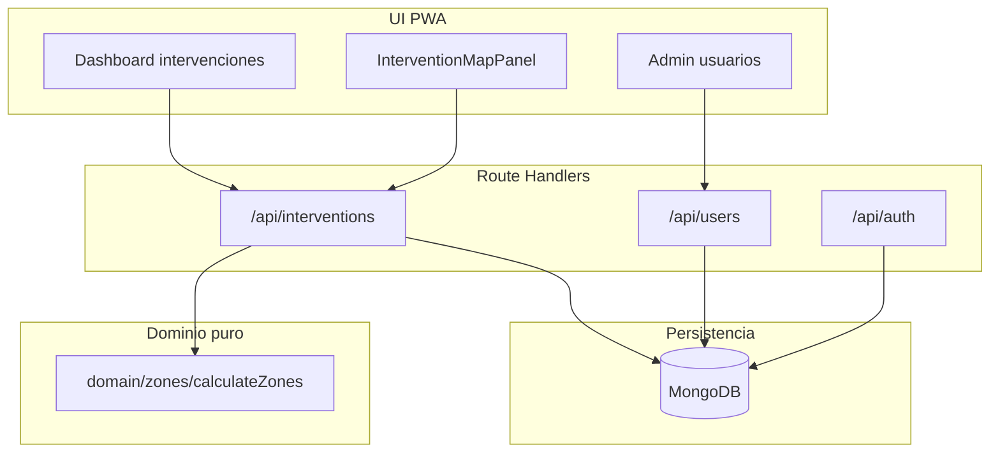

<!-- BEGIN:nextjs-agent-rules -->

# This is NOT the Next.js you know

This version has breaking changes — APIs, conventions, and file structure may all differ from your training data. Read the relevant guide in `node_modules/next/dist/docs/` (resolved from this file's directory; in monorepos the `next` package may not be visible from the repo root) before writing any code. Heed deprecation notices.

This block is written and re-added by `next dev` — verify at `node_modules/next/dist/server/lib/generate-agent-files.js`. Removing it from a diff only re-creates the uncommitted change; committing it with your work keeps the tree clean.

<!-- END:nextjs-agent-rules -->

# RAD TEDAX — Contexto para agentes

PWA de apoyo al jefe de la intervención radiológica. Unifica zonificación táctica, control de dosis e intervinientes, e informe operativo en una sola actuación trazable.

Para arranque local, scripts y deploy, ver [README.md](README.md).

## Visión del producto

Asistente digital para la intervención radiológica. La aplicación ayuda al líder operativo a:

- Situar la intervención y delimitar zonas radiológicas sobre el escenario.
- Seguir al equipo, repartir exposición y mantener la actuación dentro de los límites.
- Documentar la operación en un informe unificado con trazabilidad posterior.

| Concepto de negocio | En código / UI |
| --- | --- |
| Jefe de intervención | Rol `leader` o `manager` |
| Interviniente | Rol `participant` (puede existir sin cuenta de acceso) |
| Zona I / Zona II | `zoneI` / `zoneII` (GeoJSON Polygon; labels "Medidas Urgentes" / "Alerta") |
| Punto de control | `manualOverrides.controlPoint` |
| Estación de descontaminación | **No implementada** (roadmap) |
| Dosis estimada = tasa × tiempo | **No implementada**; hoy solo metadatos de límites (`limitZoneI`, `limitZoneII`) |
| Informe operativo | **No implementado** (roadmap) |

Nombre comercial en la PWA: **RAD TEDAX** (`app/manifest.ts`).

## Pilares funcionales

### 1. Mapa táctico y zonificación

Situar la intervención sobre el escenario.

**Implementado**

- Mapa MapLibre con capas calle y satélite (tiles Esri).
- Búsqueda por dirección (Nominatim) o coordenadas.
- Punto de intervención (centro de zonas).
- Círculos Zona I y Zona II calculados en `domain/zones/`.
- Ajuste de radios según medición del radiámetro.
- Edición manual de polígonos de zona.
- Punto de control (`manualOverrides.controlPoint`).
- Límites de dosis como metadatos en `zoneParams` (no afectan al cálculo geométrico).

**Planificado**

- Estación de descontaminación en el mapa.
- Fórmula radiológica definitiva (hoy `v1-placeholder` = círculos concéntricos con Turf).

### 2. Control de dosis e intervinientes

Seguimiento del equipo durante la entrada en zona.

**Implementado**

- Alta de usuarios e intervinientes (`/admin/users`, diálogo "Crear interviniente").
- Roles y permisos centralizados en `lib/services/permissions.ts`.
- Asignación de `participantIds` en intervenciones.

**Planificado**

- Equipos y asignación por equipo.
- Cálculo de dosis acumulada: `dosis estimada = tasa de dosis × tiempo en zona`.
- Barras de progreso con semáforo de riesgo.
- Apoyo al relevo para repartir la exposición.
- Objetivo: evitar que un solo interviniente asuma toda la dosis y mantener la actuación dentro del límite marcado.

### 3. Informe final y trazabilidad

Documentar la actuación en un único informe.

**Planificado**

- Fecha, hora y duración de cada fase.
- Ubicación y cinturones establecidos.
- Dosis acumulada del equipo y de cada interviniente.
- Registro de incidencias.
- Exportación / snapshot al cerrar la intervención (`status: closed`).

## Estado MVP vs roadmap

| Área | Estado |
| --- | --- |
| Auth (Credentials, JWT) | Implementado |
| CRUD intervenciones | Implementado |
| Mapa y zonificación | Implementado (fórmula placeholder) |
| Punto de control | Implementado |
| Estación de descontaminación | Planificado |
| Dosimetría y relevos | Planificado |
| Informe operativo | Planificado |
| PWA instalable (manifest, sin SW) | Implementado (sin offline ni caché de datos) |
| Registro público de usuarios | No previsto (seed o admin) |

## Roles y permisos

Fuente de verdad: `lib/services/permissions.ts`. La autorización debe aplicarse en servicios, no solo ocultando UI.

| Rol | UI | Permisos |
| --- | --- | --- |
| `manager` (Gestor) | Acceso completo | Crear cualquier rol; listar/editar/borrar intervenciones |
| `leader` (Líder) | Panel operativo | Crear intervenciones propias; gestionar intervinientes; no borra intervenciones ni gestiona managers/leaders |
| `participant` (Interviniente) | Sin acceso al panel | Registro operativo; sin login ni listado de intervenciones |

## Arquitectura



### Capas de código

```
app/              → páginas (RSC) + Route Handlers REST
components/       → UI React (mapa = client-only, dynamic import)
domain/           → lógica pura, sin React ni MongoDB
lib/services/     → orquestación + autorización + AppError
lib/repositories/ → acceso MongoDB
lib/validations/  → esquemas Zod compartidos API/UI
lib/types.ts      → tipos de documentos MongoDB y dominio
```

## Stack tecnológico

- **Frontend**: Next.js 16 App Router, React 19, TypeScript, Tailwind CSS 4, Lucide icons.
- **PWA**: manifest web (`app/manifest.ts`); instalable en pantalla de inicio, sin service worker ni offline. Limpieza de SW legacy en `components/pwa/ServiceWorkerCleanup.tsx`.
- **Auth**: Auth.js v5 (NextAuth), JWT en cookie httpOnly, Credentials provider (`lib/auth.ts`, `middleware.ts`).
- **Datos**: MongoDB driver oficial (`lib/db.ts`); colecciones `users`, `interventions`.
- **Mapas**: MapLibre GL; tiles Esri; geocoding Nominatim (`lib/geocoding/`).
- **Dominio geo**: Turf `@turf/circle` para polígonos de zona.
- **Validación**: Zod 4 (`lib/validations/`).
- **Tests**: Vitest; tests en `domain/zones/` y `lib/services/permissions.test.ts`.

## Modelo de datos esencial

Definido en `lib/types.ts`.

**InterventionDoc**

- `status`: `draft` | `active` | `closed`
- `location`: punto GeoJSON + etiqueta opcional
- `zoneParams`: radios, versión de fórmula, límites de dosis
- `zones`: polígonos calculados (`zoneI`, `zoneII`)
- `manualOverrides`: polígonos editados, notas, `controlPoint`
- `participantIds`: intervinientes asignados

**UserDoc**

- `role`: `manager` | `leader` | `participant`
- `email`: nullable (intervinientes pueden no tener cuenta)
- `passwordHash`: nullable si no tienen acceso al sistema

**Defaults de zona**

- Zona I: ≥ 5 mSv/h
- Zona II: entre 100 µSv/h y 5 mSv/h

## Convenciones de código

- Respuestas API: `{ data }` en éxito; `{ error: { code, message } }` en fallo; helpers `jsonData` / `jsonError` en `lib/api.ts` con `Cache-Control: no-store`.
- Peticiones cliente: usar `apiFetch` de `lib/api-client.ts` (mensajes de red explícitos).
- Coordenadas GeoJSON: siempre `[longitude, latitude]`.
- UI y mensajes de usuario: **español (es-ES)**.
- Mapa: import dinámico con `ssr: false` (ver `InterventionMapPanel.tsx`).
- Nuevas fórmulas de zona: implementar en `domain/zones/formulas/` y enrutar por `formulaVersion` en `calculateZones.ts`.
- No añadir registro público; usuarios vía `npm run seed` o panel admin.

### React (componentes cliente)

- **No sincronizar props con estado local en `useEffect`**. ESLint (React 19) rechaza `useEffect(() => { setState(prop) }, [prop])` porque provoca renders en cascada.
- **Alternativas** (en orden de preferencia):
  1. Derivar el valor directamente de la prop si no hace falta estado local.
  2. Ajustar el estado durante el render con una prop “prev” (ver `InterventionParticipantsPanel.tsx`):

```tsx
const [value, setValue] = useState(initialValue);
const [prevInitial, setPrevInitial] = useState(initialValue);

if (initialValue !== prevInitial) {
  setPrevInitial(initialValue);
  setValue(initialValue);
}
```

  3. Forzar remount con `key` en el padre si todo el estado del componente debe resetearse.
- **`useEffect` sí** para suscripciones externas, DOM, timers o fetch — no para espejar props en state.

## UX y diseño

- PWA móvil-first, `display: standalone`, tema oscuro por defecto (`#071c35`).
- Design system con CSS variables semánticas en `app/globals.css`: `background`, `card`, `surface`, `muted`, `accent`, `warning`, `danger`, `success`, `info`.
- Componentes base en `components/ui/forms.tsx` y `components/ui/Dialog.tsx` (no hay shadcn/ui).
- Tema claro/oscuro vía `components/theme/ThemeProvider.tsx`.

## Desarrollo local

1. Copiar `.env.example` → `.env.local` con `MONGODB_URI` y `AUTH_SECRET`.
2. `npm install && npm run seed` → usuario gestor `manager@example.com` / `changeme123`.
3. `npm run dev` — abrir http://localhost:3000.
4. `npm test` — tests unitarios.
5. Build de producción: `npm run build` (`next build`).

## Al implementar nuevas features

- **Dosimetría y relevos**: nuevo subdominio (p. ej. `domain/dosimetry/`) separado del cálculo de zonas.
- **Informe operativo**: agregar entidad o snapshot al cerrar intervención (`status: closed`).
- **Estación de descontaminación**: seguir el patrón de `controlPoint` en `manualOverrides`.
- **Fórmula radiológica**: sustituir `v1-placeholder` sin romper el contrato de `calculateZones`.
- Mantener lógica de negocio testeable fuera de componentes React.
